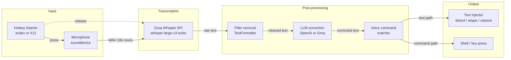

# Architecture

Holler is a small, layered Python app that converts push-to-talk audio into typed text inside any focused window. This document explains how the pieces fit together and why the non-obvious decisions were made.

## High-level pipeline



## Module layout

```
src/
├── app.py                  # HollerApp: orchestrator, Qt event loop, thread bridge
├── main.py                 # Entry point
├── core/
│   ├── config.py           # Config dataclass (load/save JSON)
│   └── session.py          # Detects X11 vs Wayland + desktop environment
├── audio/
│   └── recorder.py         # sounddevice InputStream → WAV bytes
├── transcription/
│   └── groq_client.py      # Thin wrapper over Groq Whisper API
├── text/
│   ├── formatter.py        # Filler-word removal, basic cleanup
│   └── corrector.py        # LLM correction (Groq or OpenAI), two modes
├── input/
│   ├── hotkey_evdev.py     # Wayland-compatible hotkey (reads /dev/input)
│   ├── hotkey_x11.py       # X11 hotkey via pynput
│   ├── clipboard.py        # wl-copy / xclip abstraction
│   └── injector.py         # dotool / wtype / xdotool routing + paste fallback
├── commands/
│   └── command_handler.py  # Matches spoken phrases → shell/key actions
└── ui/
    ├── tray.py             # System tray + menu
    ├── overlay.py          # Recording indicator (disabled on Wayland)
    └── settings.py         # First-run + settings dialog
```

## Threading model

The app runs on three logical threads:

1. **Qt main thread** — owns the tray, menus, and settings dialog.
2. **Hotkey thread** — either an evdev read loop (Wayland) or a pynput listener (X11). Never touches Qt directly.
3. **Transcription worker** — a short-lived `threading.Thread` spawned per utterance in `HollerApp._transcribe_async`. Calls Groq + the correction LLM, then emits a Qt signal.

All cross-thread communication goes through the `SignalBridge` in `src/app.py:23`. This is a common pattern for mixing blocking I/O with Qt's main loop without deadlocking the UI.

## Platform detection

The key non-obvious decision is in `src/core/session.py`. The app picks its hotkey backend and text-injection tool at runtime:

| Session | Hotkey | Clipboard | Injection |
|---|---|---|---|
| X11 | `pynput` | `xclip` | `xdotool` |
| Wayland (most) | `evdev` | `wl-clipboard` | `wtype` |
| Wayland + COSMIC | `evdev` | `wl-clipboard` | **`dotool`** (see below) |

### Why `dotool` on COSMIC specifically

`wtype` reports success but types the wrong characters on COSMIC — it sends raw keycodes through a path that the compositor interprets differently from the user's layout. `dotool` talks to `/dev/uinput` directly, which COSMIC handles correctly. Detection lives in `Session.is_cosmic` and the routing is in `src/input/injector.py:26-34`.

This is the kind of platform quirk you only find by actually using the tool daily — it's the main reason the repo has platform detection as a first-class concern rather than a runtime flag.

## Two correction modes

`TextCorrector` ships with two prompt families — selectable from the tray menu:

- **Transcription mode** — literal fidelity. Fixes capitalization, spelling, and spoken punctuation ("question mark" → `?`) without changing meaning.
- **Prompt mode** — rephrases a half-spoken thought into a clean prompt for LLMs, without adding content.

Both modes have English and Portuguese variants selected by `language`. The LLM is instructed to translate-back if Whisper misdetects the language, which makes the pipeline more robust than language detection on the audio alone.

Each correction is capped by a **length sanity check** (`src/text/corrector.py:201`): if the LLM output is >2× or <0.3× the input length, we discard it and return the raw transcription. This is a cheap guardrail against hallucinated expansions or truncations.

## Multi-provider LLM layer

`TextCorrector` abstracts the correction LLM behind a provider switch. Current providers:

- **OpenAI** (`gpt-4o-mini`) — default. Best quality, lowest cost per call.
- **Groq** (`llama-3.3-70b-versatile`) — fastest, free tier available, uses the same API key as transcription.

The abstraction only leaks in `_get_client()` — both providers expose OpenAI-compatible `chat.completions.create`, so the caller is provider-agnostic.

## Cost profile

For typical usage (a few minutes of dictation per day):

| Component | Cost per hour of audio |
|---|---|
| Groq Whisper (`whisper-large-v3-turbo`) | ~$0.04 |
| Correction LLM (`gpt-4o-mini`) | fractions of a cent per call |
| Correction LLM (Groq Llama 3.3 70B) | free tier covers heavy daily use |

Monthly cost observed in daily use: **well under $1**.

## Extension points

- **New STT provider** — add a class with the same shape as `GroqTranscriber` and wire it in `HollerApp.__init__`.
- **New correction provider** — extend the `_get_client()` branch in `TextCorrector`.
- **New desktop environment** — add a branch in `Session._detect_desktop_environment` and, if needed, a routing rule in `TextInjector`.
- **Voice commands** — add `phrase → shell command` or `phrase → key name` pairs in `config.json`; see `src/commands/command_handler.py`.

## Known limitations

- Wayland overlay is disabled because Qt overlays steal focus on COSMIC/GNOME. Status is shown via the tray icon instead.
- The first spoken word is occasionally clipped because the audio stream is started *after* the hotkey press — fixing this cleanly requires a rolling pre-buffer.
- Correction latency adds ~300-600 ms on top of Groq's transcription. This is acceptable for full-sentence dictation but noticeable for short commands.
